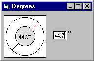



## A MUST HAVE CONTROL FOR ALL VB PROGRAMMERS: Degree of Rotation Control\.

### Description

When placed on a form, this Control will take whatever its .Value is and show you what angle of rotation you've entered. GREAT FOR Graphic / Multimedia / Game Application Development
 
### More Info
 

             |
---                |---
**Submitted On**   |2000-08-01 08:36:44
**By**             |[Sparq](https://github.com/Planet-Source-Code/PSCIndex/blob/master/ByAuthor/sparq.md)
**Level**          |Intermediate
**User Rating**    |4.5 (18 globes from 4 users)
**Compatibility**  |VB 5\.0, VB 6\.0
**Category**       |[Custom Controls/ Forms/  Menus](https://github.com/Planet-Source-Code/PSCIndex/blob/master/ByCategory/custom-controls-forms-menus__1-4.md)
**World**          |[Visual Basic](https://github.com/Planet-Source-Code/PSCIndex/blob/master/ByWorld/visual-basic.md)
**Archive File**   |[CODE\_UPLOAD8468812000\.zip](https://github.com/Planet-Source-Code/sparq-a-must-have-control-for-all-vb-programmers-degree-of-rotation-control__1-10283/archive/master.zip)

